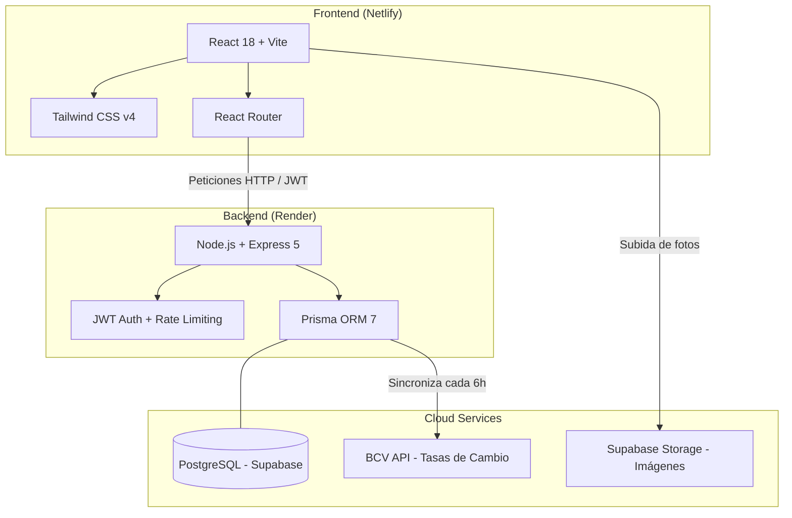

<div align="center">

# 🏋️ CentralFit

**SaaS de Gestión de Gimnasios Multi-Tenant | Manejo Dual de Divisas (USD/Bs)**

[]()
[]()
[]()
[]()
[]()
[]()

</div>

<p align="center">
  <em>Plataforma integral diseñada para el mercado venezolano. Automatiza cobros, maneja pagos divididos en múltiples monedas, controla la asistencia biométrica y genera reportes financieros en tiempo real.</em>
</p>

---

## 🌟 Características Destacadas

- 🏢 **Arquitectura Multi-Tenant:** Una sola base de datos que aísla perfectamente la información de cada gimnasio usando JWT y filtrado por `gymId`.
- 💵 **Motor de Pagos Divididos:** Permite cobrar una membresía combinando Efectivo (USD), Zelle (USD), Binance (USD) y Pago Móvil (Bs) en una sola transacción, con validación matemática estricta.
- 📈 **Tasas BCV y Euro Automáticas:** Integración con la API del Banco Central de Venezuela. El sistema calcula los precios en Bolívares al vuelo y permite fijar precios paralelos para proteger contra la devaluación.
- 🍰 **Automatización de WhatsApp:** Notificaciones automáticas en el panel que abren WhatsApp Web con mensajes predeterminados para recordar pagos vencidos o felicitar cumpleaños.
- 📷 **Control de Asistencia:** Módulo de entrada simulando un lector de huellas/QR, validando el estado de la membresía al instante.
- 📊 **Reportes Interactivos:** Gráficos SVG nativos (líneas y dona) con tooltips, filtrado por fechas personalizadas y exportación a CSV compatible con Excel.

## 🏗️ Arquitectura del Sistema

CentralFit utiliza una arquitectura moderna desacoplada (SPA + API REST), alojada en la nube para máxima disponibilidad.



## 🛠️ Tech Stack

| Capa | Tecnología | Descripción |
| :--- | :--- | :--- |
| **Frontend** |    | Interfaz SPA rápida y responsiva. |
| **Backend** |   | API RESTful robusta y tipada. |
| **Base de Datos** |   | Modelo relacional con migraciones automáticas. |
| **Auth & Security** | JWT, CORS, Rate Limiting | Doble esquema de tokens (Admin/Gym) y protección anti-bots. |
| **Infraestructura** | Render, Netlify, Supabase | Despliegue continuo (CI/CD) integrado a GitHub. |

## 📂 Estructura del Repositorio

El proyecto está estructurado como un monorepo conteniendo el frontend y el backend:

```text
CentralFit/
├── 📂 centralfit-api/      # Código del Backend (Node/Express/Prisma)
│   ├── prisma/             # Schema, migraciones y seeds
│   ├── src/                 # Lógica de rutas, middleware y librerías
│   └── README.md           # Documentación específica del Backend
│
├── 📂 Frontend/             # Código del Frontend (React/Vite/Tailwind)
│   ├── public/             # Assets estáticos y reglas de Netlify
│   ├── src/                 # Componentes, vistas y helpers de API
│   └── README.md           # Documentación específica del Frontend
│
└── README.md               # (Estás aquí) Documentación general del proyecto
```

## 🚀 Inicio Rápido (Desarrollo Local)

Para correr el proyecto en tu computadora, necesitas tener instalado **Node.js** y acceso a una instancia de **PostgreSQL** (puedes crear una gratis en Supabase).

1. **Clona el repositorio:**
   ```bash
   git clone https://github.com/GaboSandova1/CentralFit.git
   cd CentralFit
   ```

2. **Configura el Backend:**
   ```bash
   cd centralfit-api
   npm install
   # Crea tu archivo .env basándote en el README del backend
   npx prisma migrate dev --name init
   npm run dev
   ```
   El servidor backend correrá en `http://localhost:3000`.

3. **Configura el Frontend (en otra terminal):**
   ```bash
   cd Frontend
   npm install
   # Crea tu archivo .env con la URL del backend y las claves de Supabase
   npm run dev
   ```
   La interfaz gráfica correrá en `http://localhost:5173`.

> 💡 **Tip:** Revisa los archivos `README.md` dentro de cada subcarpeta (`centralfit-api/` y `Frontend/`) para instrucciones detalladas de configuración de variables de entorno.

## 📜 Licencia

Este proyecto es de código privado. © 2024 Gabriel Sandoval & Dustin López. Todos los derechos reservados.

---

<div align="center">
  Hecho con 💚 y mucho ☕ en Venezuela.
</div>
